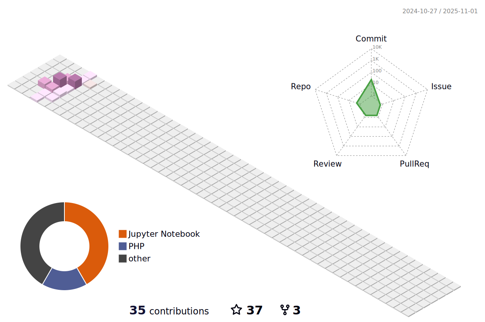

 

# HEY 👋🏼 ,I am [SK!](https://github.com/SKsaikiran) :octocat:
### About Me  ^_^ 
📠I am currently pursuing B.E in Computer Science at JIT.   
 👾 I enjoy learning and developing new things 👨‍💻  
  
 🔗 &nbsp;**Connect with me 🤝**   

 
